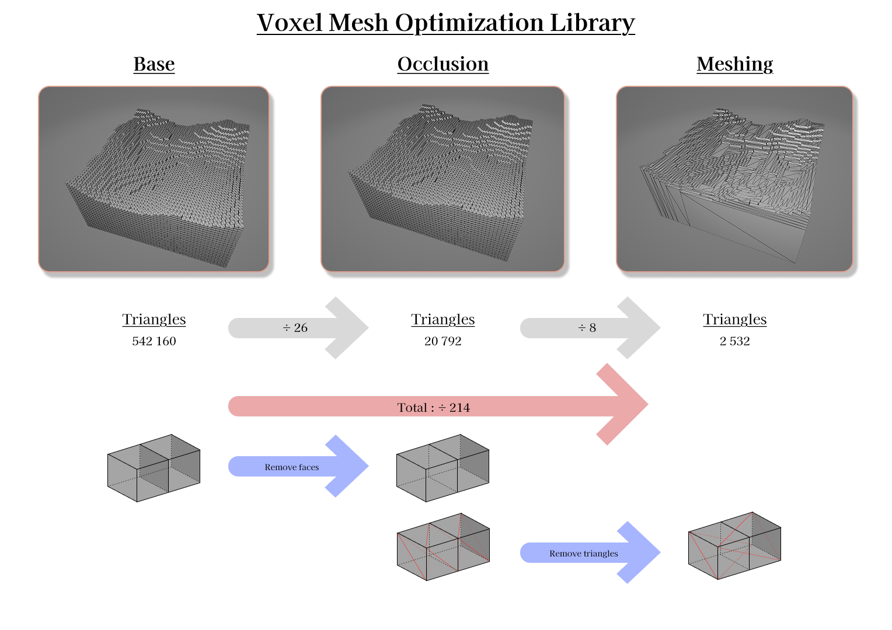

# Voxel Mesh Optimization Library

A C# library that converts a chunk of coloured voxels into an optimized triangle mesh.  Hidden faces are discarded and adjacent quads with the same colour are merged, producing compact meshes suitable for real‑time rendering.




## Features

- **Occlusion culling** of non visible voxel faces.
- **Disjoint‑set quad merging** to minimise triangle count.
- **OBJ exporter** to inspect generated meshes.
- **Chunk utilities** such as a Perlin noise generator and simple save/load helpers.
- **Benchmark suite** with GitHub Actions and published results.
- Targets **.NET 8** and is entirely engine agnostic.

## Installation
```bash
dotnet add package VoxelMeshOptimizer
```

## Usage
```csharp
using VoxelMeshOptimizer.Core;
using VoxelMeshOptimizer.Core.OptimizationAlgorithms.DisjointSet;
using VoxelMeshOptimizer.Toolkit;

// ExampleChunk implements Chunk<Voxel>
var chunk = new ExampleChunk(PerlinNoiseChunkGen.CreatePerlinLandscape(50, 123));
var optimizer = new DisjointSetMeshOptimizer(new ExampleMesh());
Mesh mesh = optimizer.Optimize(chunk);

// Export to Wavefront OBJ
File.WriteAllText("chunk.obj", ObjExporter.MeshToObjString(mesh));
```

## Workflow
1. Build or load a `Chunk<Voxel>`.
2. `VoxelOcclusionOptimizer` determines visible faces.
3. `DisjointSetVisiblePlaneOptimizer` merges faces on each plane.
4. Quads are assembled into a single optimized mesh.

## Development


For detailed guidelines on setting up a development environment, contributing code, or reporting issues, please refer to:

- [CONTRIBUTING.md](CONTRIBUTING.md)
- [CODE_OF_CONDUCT.md](CODE_OF_CONDUCT.md)
- [CHANGELOG.md](CHANGELOG.md)

- Clone the repository and run:
  ```bash
  dotnet restore
  dotnet test
  ```
- Example applications and benchmarks live in the `examples` folder.
- Benchmark results are published on the project’s GitHub Pages.

## Support

If you have questions, need help, or wish to contribute further improvements, please open an issue in the repository or reach out directly. Contributions and feedback are greatly appreciated!

## License
Distributed under the MIT licence. See [LICENSE](LICENSE) for more information.
