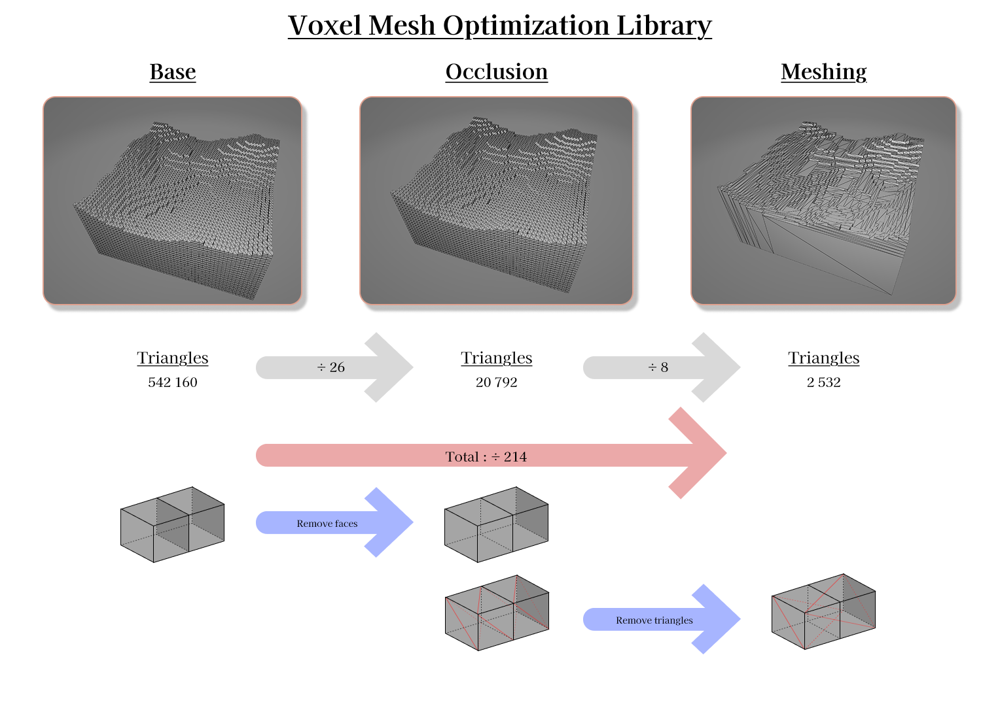

# Voxel Mesh Optimization Library

A C# library that converts a chunk of coloured voxels into an optimized triangle mesh.  Hidden faces are discarded and adjacent quads with the same colour are merged, producing compact meshes suitable for real‑time rendering.



## Known issues

- **Compatibility** : The library as missing compatibility for a job system
- **Not 100% optimized** : Some parts of the algorithm isn't fully optimized.
- **Dependency Injections and chunk implementation** : Chunks are currently implemented inside the library which isn't perfect, I will add dependency injection later.


## Features

- **Occlusion culling** of non visible voxel faces.
- **Disjoint‑set quad merging** to minimise triangle count.
- **OBJ exporter** to inspect generated meshes.
- **Chunk utilities** such as a Perlin noise generator and simple save/load helpers.
- **Benchmark suite** with GitHub Actions and published results.
- Targets **.NET 8** and is engine agnostic.
- **TaskManager** for multithreading operations with and without thread blocking.

## Installation
```bash
dotnet add package VoxelMeshOptimizer
```

## Usage

### Direct optimization
This way is recommended if you have a small amount of chunks, you'll run this one at the time and see the result directly.

```csharp
using VoxelMeshOptimizer.Core;
using VoxelMeshOptimizer.Core.OptimizationAlgorithms.DisjointSet;
using VoxelMeshOptimizer.Toolkit;

// ExampleChunk implements Chunk<Voxel>
var chunk = new Chunk(PerlinNoiseChunkGen.CreatePerlinLandscape(50, 123));
var optimizer = new DisjointSetMeshOptimizer(new Mesh());
Mesh mesh = optimizer.Optimize(chunk);

// Option 1 : Export to Wavefront OBJ
File.WriteAllText("chunk.obj", ObjExporter.MeshToObjString(mesh));

// Option 2 : Get all the Quads for a in-engine usage (1 Quad = 2 triangles)
List<MeshQuad> quads = mesh.Quads;
```

### Multithreading usage


```csharp
using VoxelMeshOptimizer.Core;
using VoxelMeshOptimizer.Core.OptimizationAlgorithms.DisjointSet;
using VoxelMeshOptimizer.Toolkit;

// Initialization of the TaskManager
using CancellationTokenSource cts = new();
// Decomposition of the types : 
// - Int3 pos : Position of the chunks, usefull when generating a bunch of chunks and you need to remember where to put them
// - Func<Int3, Chunk> gen : Funciton to generate the Chunk's data
// - (Chunk chunk, Mesh mesh) : Result of a task, the initial chunk and its mesh
TaskManager<(Int3 pos, Func<Int3, Chunk> gen), (Chunk chunk, Mesh mesh)> manager =  new(
    workerCount: Environment.ProcessorCount, // TODO : set to 1 if you want one worker
    processor: (job, ct) => // TODO : What one job actually do
    {
        (Int3 pos, Func<Int3, Chunk> gen) = job;
        Chunk chunk = gen(pos);

        DisjointSetMeshOptimizer optimizer = new(new Mesh([]));
        Mesh mesh = optimizer.Optimize(chunk);

        return ValueTask.FromResult((chunk, mesh));
    }
);


// Creating chunks
int iterations = 3;
Int3 chunkPos = new() { x = 0, y = 0, z = 0 };
for (int i = 0; i < iterations; i++)
{
    _ = manager.Enqueue((chunkPos,
        p => new Chunk(PerlinNoiseChunkGen.CreatePerlinLandscape(size: 16, seed: 123))));
}

for (int i = 0; i < iterations; i++)
{
    if (manager.TryDequeueCompleted(out TaskManager<(Int3 pos, Func<Int3, Chunk> gen), (Chunk chunk, Mesh mesh)>.Completion r))
    {
        if (r.Error) {
            // An issue occured during the process
            // TODO : Handle the error
        }
        
        // TODO : Do what you like with the chunk
    }
    else
    {
        // TODO : Continue program's work and come back later
    }
    
}

// Destroy manager and prevent leaks
await manager.DisposeAsync();
```

## General workflow
1. Build or load a `Chunk<Voxel>`.
2. `VoxelOcclusionOptimizer` determines visible faces.
3. `DisjointSetVisiblePlaneOptimizer` merges faces on each plane.
4. Quads are assembled into a single optimized mesh.

## Development


For detailed guidelines on setting up a development environment, contributing code, or reporting issues, please refer to:

- [CONTRIBUTING.md](CONTRIBUTING.md)
- [CODE_OF_CONDUCT.md](CODE_OF_CONDUCT.md)
- [CHANGELOG.md](CHANGELOG.md)
- Clone the repository and run :
  ```bash
  cd VoxelMeshOptimizerLibrary
  dotnet restore
  dotnet test
  ```
- Example applications and benchmarks live in the `examples` folder.
- Benchmark results are published on the project’s GitHub Pages.

### Benchmark
- Move to benchmark directory
- Execute : 
  ```bash
  dotnet restore
  dotnet run --configuration Release
  ```

## Support

If you have questions, need help, or wish to contribute further improvements, please open an issue in the repository or reach out directly. Contributions and feedback are greatly appreciated!

## License
Distributed under the MIT licence. See [LICENSE](LICENSE) for more information.
