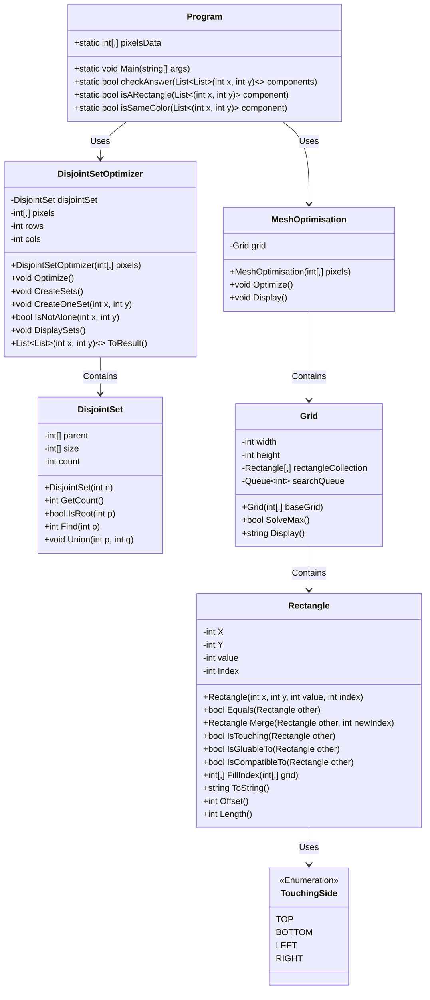

Here is the current readme/documentation of the project : 
# Voxel Mesh Optimization Project Description

## Project Context
This project aims to create a modular, technology-agnostic C# library for voxel-based mesh optimization. The library is designed to efficiently merge individual voxel meshes into optimized meshes suitable for real-time game applications. It is being initially developed as a standalone console application, with future potential for integration into various projects, including those developed with Unity.

## Project Objective
The primary objective is to merge voxel meshes into larger, optimized meshes by:

- Mesh optimisation :
  - Occluding hidden voxel faces.
  - Minimizing the total count of triangles and vertices.
  - Ensuring the mesh optimization algorithm is performant enough for real-time execution.
- Project packaging : 
  - Have some allow custom implementation of chunks, voxels and meshes interfaces for easier inclusion of the library into the project and also allow people that have specific concerns about performance.
  - Have a clean project to allow easy maintain and understanding
  - A CI/CD pipeline to package the project as a library (or things like that)
  - A clear separation between the actual business logic of the library and the C# program/project used to develop the library. The idea would be to be able to "just" have the library without the useless code (tests, program.cs, etc...) 
  - Interfaces should not start with a "I" (ie: Chunk instead of IChunk)


## Current Implementation Overview
The current implementation uses a Disjoint Set (Union-Find) approach to optimize the mesh by merging rectangles of voxels sharing the same color. It employs structured and modular classes and is tested within a console application environment.

### Mermaid Diagram of the Current Structure
The diagram below illustrates the current class relationships and core functionality:




Current file hierarchy : 
```
.
├── VoxelMeshOptimizerLibrary.sln
├── examples
│   └── ConsoleAppExample
│       ├── ConsoleAppExample.csproj
│       ├── ExampleChunk.cs
│       ├── ExampleMesh.cs
│       ├── ExampleVoxel.cs
│       └── Program.cs
├── src
│   └── VoxelMeshOptimizer.Core
│       ├── Chunk.cs
│       ├── Mesh.cs
│       ├── MeshOptimizer.cs
│       ├── OptimizationAlgorithms
│       │   └── DisjointSet
│       │       ├── DisjointSet.cs
│       │       ├── DisjointSet2DOptimizer.cs
│       │       └── DisjointSetMeshOptimizer.cs
│       ├── Voxel.cs
│       └── VoxelMeshOptimizer.Core.csproj
└── tests
    └── VoxelMeshOptimizer.Tests
        ├── DisjointSet
        │   ├── DisjointSet2DOptimizerTests.cs
        │   ├── DisjointSetMeshOptimizerTests.cs
        │   └── DisjointSetTests.cs
        └── VoxelMeshOptimizer.Tests.csproj
```